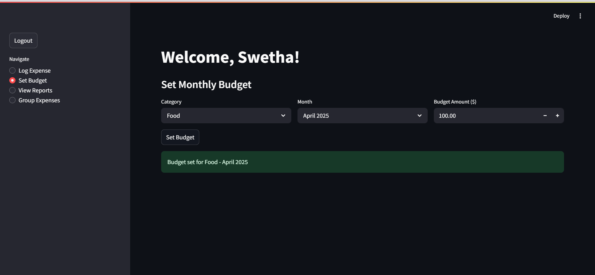
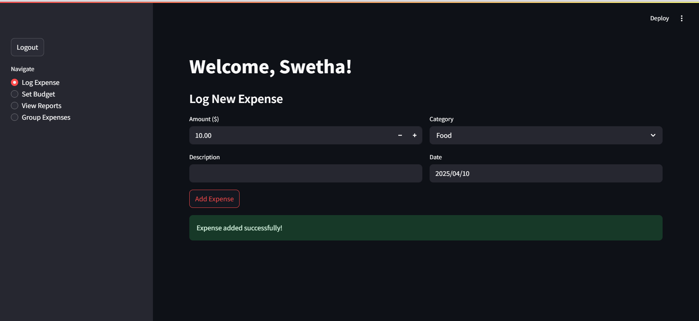
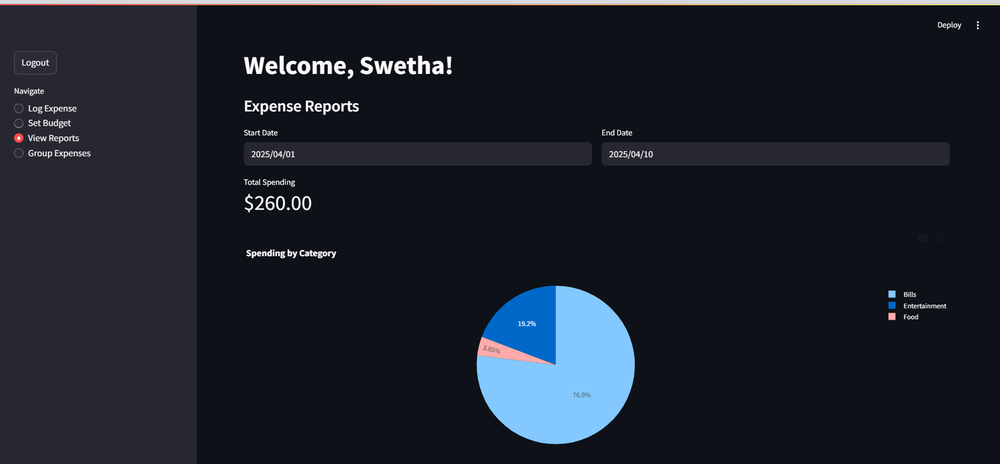
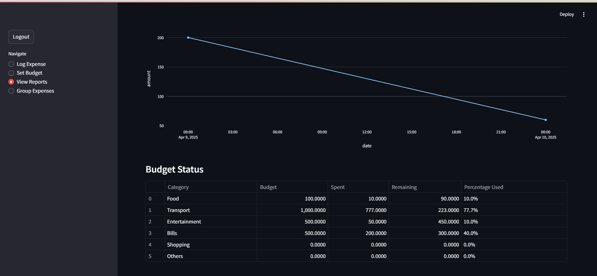

# Expense Tracker Application

A Streamlit-based expense tracking application that helps users manage their expenses, set budgets, and track spending habits. The application includes features for expense logging, budget management, spending reports, and group expense sharing.

## Features

### Core Features
- User authentication and account management
- Daily expense logging with categories
- Monthly budget setting for each category
- Real-time budget tracking and alerts
- Detailed expense reports and visualizations

### Extra Credit Features
- Different budgets for different months
- Custom alerts when budget threshold is reached (90% by default)
- Email notifications for budget alerts
- Group expense sharing functionality (similar to Splitwise)

## Prerequisites

- Python 3.9 or higher
- Docker (optional, see below for instructions)

## Installation and Setup

### Local Setup (Recommended)

1. Clone the repository:
```bash
git clone https://github.com/NagaSwetha123/Expense-Tracker.git
cd expense-tracker
```

2. Set up a virtual environment (Recommended):
   - Follow the instructions in the [Virtual Environment Setup](#virtual-environment-setup) section below.
   - This ensures clean dependency management and isolation.

3. Install dependencies:
```bash
pip install -r requirements.txt
```

4. Set up environment variables for email notifications (see [Email Setup](#email-setup) below):
```bash
# Linux/Mac
export SMTP_SERVER='smtp.gmail.com'
export SMTP_PORT='587'
export SMTP_USERNAME='your-email@gmail.com'
export SMTP_PASSWORD='your-app-specific-password'

# Windows
set SMTP_SERVER=smtp.gmail.com
set SMTP_PORT=587
set SMTP_USERNAME=your-email@gmail.com
set SMTP_PASSWORD=your-app-specific-password
```

5. Run the application:
```bash
streamlit run src/app.py
```

## Testing Steps

1. User Authentication
   - Open the application
   - Try signing up with a new account
   - Verify login functionality
   - Test logout and session management

2. Expense Logging
   - Log a new expense with all required fields
   - Verify the expense appears in the reports
   - Test date selection functionality
   - Validate amount input constraints

3. Budget Management
   - Set monthly budgets for different categories
   - Test budget updates
   - Verify different budgets for different months
   - Ensure budget alerts trigger appropriately

4. Reports and Analytics
   - Check if expense reports show correct totals
   - Verify pie chart and line chart data accuracy
   - Test date range filtering
   - Validate budget vs. spending comparisons

5. Group Expenses
   - Create a new expense group
   - Add group members
   - Log group expenses
   - Verify expense splitting calculations
   - Test group expense reports

6. Email Notifications
   - Set up email credentials (see [Email Setup](#email-setup))
   - Trigger a budget alert
   - Verify email notification is received
   - Check notification content accuracy

## Edge Cases Handled

1. Database Operations
   - Concurrent user access
   - SQLite thread safety
   - Database connection management
   - Error handling for failed operations

2. Input Validation
   - Negative amounts prevention
   - Date validation
   - Required field checks
   - Duplicate username prevention

3. Budget Alerts
   - Zero budget handling
   - Multiple alerts prevention
   - Email sending failures
   - Custom threshold validation

4. Group Expenses
   - Empty group handling
   - Member removal handling
   - Expense deletion cascading
   - Split amount rounding

## Documentation

### Code Structure

```
expense-tracker/
├── src/
│   ├── app.py           # Main Streamlit application
│   ├── database.py      # Database operations & SQL queries
│   └── utils/
│       └── alerts.py    # Alert management and email notifications
├── database/            # SQLite database directory
├── Dockerfile           # Docker configuration
├── requirements.txt     # Project dependencies
└── README.md            # Documentation
```







### Database Schema

The application uses SQLite with the following tables:
- `users`: User account information
- `categories`: Expense categories
- `expenses`: Individual expense records
- `budgets`: Monthly budget settings
- `groups`: Expense sharing groups
- `group_expenses`: Group expense records

## Deployment Options

### Development URLs
When running `streamlit run src/app.py`, Streamlit provides two URLs:
- **Local URL** (`http://localhost:8501`): 
  - For accessing the app on your local machine
  - Only accessible from the computer running the application
  - Best for development and testing

- **Network URL** (`http://192.168.x.x:8501`):
  - For accessing the app from other devices on the same network
  - Useful for testing on different devices or sharing with teammates
  - The IP address will match your computer's local network IP

### Production Deployment Options

1. **Cloud Platforms**
   - **Streamlit Cloud** (Recommended):
     ```
     1. Create an account at share.streamlit.io
     2. Connect your GitHub repository
     3. Deploy with a few clicks
     ```
   
   - **Heroku**:
     ```
     1. Create a Procfile:
        web: streamlit run src/app.py
     2. Set environment variables in Heroku dashboard
     3. Deploy using Heroku CLI or GitHub integration
     ```

   - **AWS/GCP/Azure**:
     ```
     1. Set up a virtual machine
     2. Install dependencies
     3. Use systemd or supervisor to run the app
     4. Set up a reverse proxy (nginx/apache)
     ```

2. **Docker Deployment**
   - See [Docker Setup](#docker-setup) below.

3. **Production Considerations**
   - Use a production-grade database (PostgreSQL recommended)
   - Set up SSL/TLS for secure connections
   - Implement proper backup strategies
   - Consider using a process manager (PM2, Supervisor)
   - Set up monitoring and logging
   - Configure proper authentication for public access

## Contributing

1. Fork the repository
2. Create a feature branch
3. Commit your changes
4. Push to the branch
5. Submit a pull request

## Virtual Environment Setup

Below are instructions for setting up a Python virtual environment (venv).

### Windows

1. Create a virtual environment:
```cmd
python -m venv venv
```

2. Activate the virtual environment:
```cmd
venv\Scripts\activate
```

You’ll know it’s activated when you see `(venv)` at the beginning of your command prompt.

3. Install dependencies:
```cmd
pip install -r requirements.txt
```

4. Run the application:
```cmd
streamlit run src/app.py
```

5. To deactivate when you’re done:
```cmd
deactivate
```

### Linux/Mac

1. Create a virtual environment:
```bash
python3 -m venv venv
```

2. Activate the virtual environment:
```bash
source venv/bin/activate
```

You’ll know it’s activated when you see `(venv)` at the beginning of your command prompt.

3. Install dependencies:
```bash
pip install -r requirements.txt
```

4. Run the application:
```bash
streamlit run src/app.py
```

5. To deactivate when you’re done:
```bash
deactivate
```

### Troubleshooting venv

1. If `python -m venv venv` fails:
   - Make sure Python is installed and in your PATH.
   - On Ubuntu/Debian, you might need to install:
     ```bash
     sudo apt-get install python3-venv
     ```
   - On Windows, make sure you have the latest Python version.

2. If activation fails:
   - On Windows, you might need to run:
     ```cmd
     Set-ExecutionPolicy -ExecutionPolicy RemoteSigned -Scope CurrentUser
     ```
   - On Linux/Mac, ensure you have execute permissions:
     ```bash
     chmod +x venv/bin/activate
     ```

3. If pip install fails:
   - Upgrade pip first:
     ```bash
     python -m pip install --upgrade pip
     ```
   - Make sure you’re in the virtual environment (should see `(venv)` in prompt).

4. Best Practices:
   - Always activate the virtual environment before working on the project.
   - Keep requirements.txt updated when adding new dependencies.
   - Don’t commit the `venv` directory to version control (it should be in .gitignore).
   - Create a new virtual environment for each Python project.

## Email Setup

Here’s how to configure Gmail to send email notifications:

### 1. Generate an App Password for Gmail
1. Go to your Google Account settings: https://myaccount.google.com/  
2. Click on "Security" in the left sidebar.
3. Under "2-Step Verification", make sure it’s enabled.
4. Scroll down and click on "App passwords."
5. Select "Mail" as the app and choose your device type.
6. Copy the 16-character password that appears; this is your **app-specific password**—not your regular Gmail password.

### 2. Setting Environment Variables

#### Windows (Command Prompt):
```cmd
setx SMTP_SERVER smtp.gmail.com
setx SMTP_PORT 587
setx SMTP_USERNAME "your-gmail@gmail.com"
setx SMTP_PASSWORD "your-16-char-app-password"
```

#### Windows (PowerShell):
```powershell
[Environment]::SetEnvironmentVariable("SMTP_SERVER", "smtp.gmail.com", "User")
[Environment]::SetEnvironmentVariable("SMTP_PORT", "587", "User")
[Environment]::SetEnvironmentVariable("SMTP_USERNAME", "your-gmail@gmail.com", "User")
[Environment]::SetEnvironmentVariable("SMTP_PASSWORD", "your-16-char-app-password", "User")
```

#### Linux/Mac:
```bash
export SMTP_SERVER='smtp.gmail.com'
export SMTP_PORT='587'
export SMTP_USERNAME='your-gmail@gmail.com'
export SMTP_PASSWORD='your-16-char-app-password'
```

### 3. Verify Setup

- Windows (Command Prompt):  
  ```cmd
  echo %SMTP_USERNAME%
  ```
- Windows (PowerShell):  
  ```powershell
  $env:SMTP_USERNAME
  ```
- Linux/Mac:  
  ```bash
  echo $SMTP_USERNAME
  ```

### 4. Running the Application
```bash
streamlit run src/app.py
```
The application will now be able to send email notifications when budget thresholds are reached.

### Troubleshooting Email
1. **Authentication failed**: Make sure you’re using the app password.
2. **Emails not sent**: Check environment variables are set correctly & port 587 is not blocked.
3. **Variable not found**: Restart your terminal or command prompt, verify environment variables again.

## Docker Setup

Here’s how to build and run the application inside Docker.

### 1. Docker Login
```bash
docker login
```
- Enter your Docker Hub username and password.

### 2. Verify Docker Installation
```bash
docker --version
docker ps
```

### 3. Building the Image
```bash
docker build -t expense-tracker .
```

### 4. Running the Container
```bash
# Without email notifications
docker run -p 8501:8501 expense-tracker

# With email notifications (env file)
docker run -p 8501:8501 --env-file .env expense-tracker
```
(See [Email Setup](#email-setup) for details on creating a `.env` file.)

### Troubleshooting Docker
1. **Authentication errors**: Ensure you’re logged in with `docker login`.
2. **Build fails**: Check internet connection, Docker daemon is running, or prune cache.
3. **Container won’t start**: Check if port 8501 is already in use or read container logs.
4. **Common Docker commands**:
   ```bash
   docker ps              # list running containers
   docker stop <id>       # stop a container
   docker rm <id>         # remove a container
   docker images          # list images
   docker rmi <name>      # remove an image
   docker logs <id>       # view logs
   docker exec -it <id> /bin/bash  # interactive shell
   ```

----
# Expense Tracker Application

A Streamlit-based expense tracking application that helps users manage their expenses, set budgets, and track spending habits. The application includes features for expense logging, budget management, spending reports, and group expense sharing.

## Features

### Core Features
- User authentication and account management
- Daily expense logging with categories
- Monthly budget setting for each category
- Real-time budget tracking and alerts
- Detailed expense reports and visualizations

### Extra Credit Features
- Different budgets for different months
- Custom alerts when budget threshold is reached (90% by default)
- Email notifications for budget alerts
- Group expense sharing functionality (similar to Splitwise)

## Prerequisites

- Python 3.9 or higher
- Docker (optional, see docker_setup.md for Docker installation instructions)

## Installation and Setup

### Local Setup (Recommended)

1. Clone the repository:
```bash
git clone <repository-url>
cd expense-tracker
```

2. Set up a virtual environment (Recommended):
   - Follow the instructions in venv_setup.md for detailed steps
   - This ensures clean dependency management and isolation

3. Install dependencies:
```bash
pip install -r requirements.txt
```

4. Set up environment variables for email notifications:
```bash
# Linux/Mac
export SMTP_SERVER='smtp.gmail.com'
export SMTP_PORT='587'
export SMTP_USERNAME='your-email@gmail.com'
export SMTP_PASSWORD='your-app-specific-password'

# Windows
set SMTP_SERVER=smtp.gmail.com
set SMTP_PORT=587
set SMTP_USERNAME=your-email@gmail.com
set SMTP_PASSWORD=your-app-specific-password
```

5. Run the application:
```bash
streamlit run src/app.py
```

## Testing Steps

1. User Authentication
   - Open the application
   - Try signing up with a new account
   - Verify login functionality
   - Test logout and session management

2. Expense Logging
   - Log a new expense with all required fields
   - Verify the expense appears in the reports
   - Test date selection functionality
   - Validate amount input constraints

3. Budget Management
   - Set monthly budgets for different categories
   - Test budget updates
   - Verify different budgets for different months work
   - Ensure budget alerts trigger appropriately

4. Reports and Analytics
   - Check if expense reports show correct totals
   - Verify pie chart and line chart data accuracy
   - Test date range filtering
   - Validate budget vs. spending comparisons

5. Group Expenses
   - Create a new expense group
   - Add group members
   - Log group expenses
   - Verify expense splitting calculations
   - Test group expense reports

6. Email Notifications
   - Set up email credentials
   - Trigger a budget alert
   - Verify email notification is received
   - Check notification content accuracy

## Edge Cases Handled

1. Database Operations
   - Concurrent user access
   - SQLite thread safety
   - Database connection management
   - Error handling for failed operations

2. Input Validation
   - Negative amounts prevention
   - Date validation
   - Required field checks
   - Duplicate username prevention

3. Budget Alerts
   - Zero budget handling
   - Multiple alerts prevention
   - Email sending failures
   - Custom threshold validation

4. Group Expenses
   - Empty group handling
   - Member removal handling
   - Expense deletion cascading
   - Split amount rounding

## Documentation

### Code Structure

```
expense-tracker/
├── src/
│   ├── app.py           # Main Streamlit application
│   ├── database.py      # Database operations & SQL queries
│   └── utils/
│       └── alerts.py    # Alert management and email notifications
├── database/            # SQLite database directory
├── Dockerfile          # Docker configuration
├── requirements.txt    # Project dependencies
└── README.md          # Documentation
```

### Database Schema

The application uses SQLite with the following tables:
- `users`: User account information
- `categories`: Expense categories
- `expenses`: Individual expense records
- `budgets`: Monthly budget settings
- `groups`: Expense sharing groups
- `group_expenses`: Group expense records

## Deployment Options

### Development URLs
When running `streamlit run src/app.py`, Streamlit provides two URLs:
- **Local URL** (`http://localhost:8501`): 
  - For accessing the app on your local machine
  - Only accessible from the computer running the application
  - Best for development and testing

- **Network URL** (`http://192.168.x.x:8501`):
  - For accessing the app from other devices on the same network
  - Useful for testing on different devices or sharing with teammates
  - The IP address will match your computer's local network IP

### Production Deployment Options

1. **Cloud Platforms**
   - **Streamlit Cloud** (Recommended):
     ```
     1. Create an account at share.streamlit.io
     2. Connect your GitHub repository
     3. Deploy with a few clicks
     ```
   
   - **Heroku**:
     ```
     1. Create a Procfile:
        web: streamlit run src/app.py
     2. Set environment variables in Heroku dashboard
     3. Deploy using Heroku CLI or GitHub integration
     ```

   - **AWS/GCP/Azure**:
     ```
     1. Set up a virtual machine
     2. Install dependencies
     3. Use systemd or supervisor to run the app
     4. Set up a reverse proxy (nginx/apache)
     ```

2. **Docker Deployment**
   ```bash
   # Build the Docker image
   docker build -t expense-tracker .
   
   # Run the container
   docker run -p 8501:8501 expense-tracker
   ```

3. **Production Considerations**
   - Use a production-grade database (PostgreSQL recommended)
   - Set up SSL/TLS for secure connections
   - Implement proper backup strategies
   - Consider using a process manager (PM2, Supervisor)
   - Set up monitoring and logging
   - Configure proper authentication for public access

## Contributing

1. Fork the repository
2. Create a feature branch
3. Commit your changes
4. Push to the branch
5. Submit a pull request
